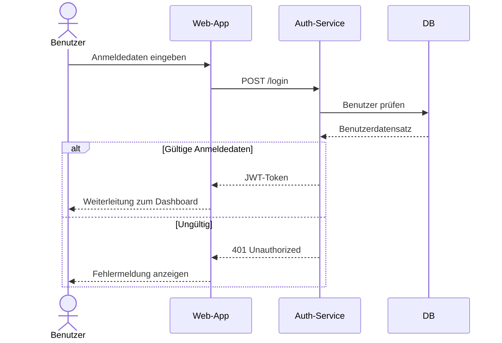
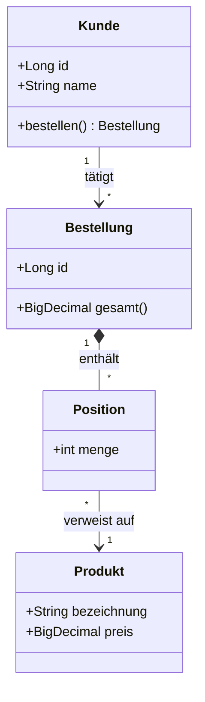
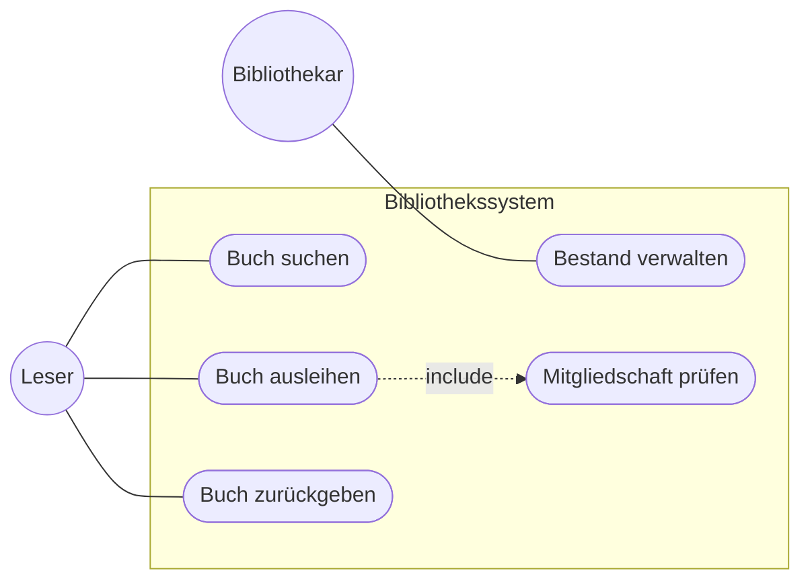
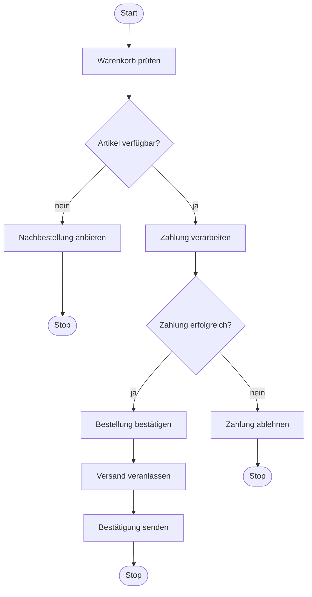
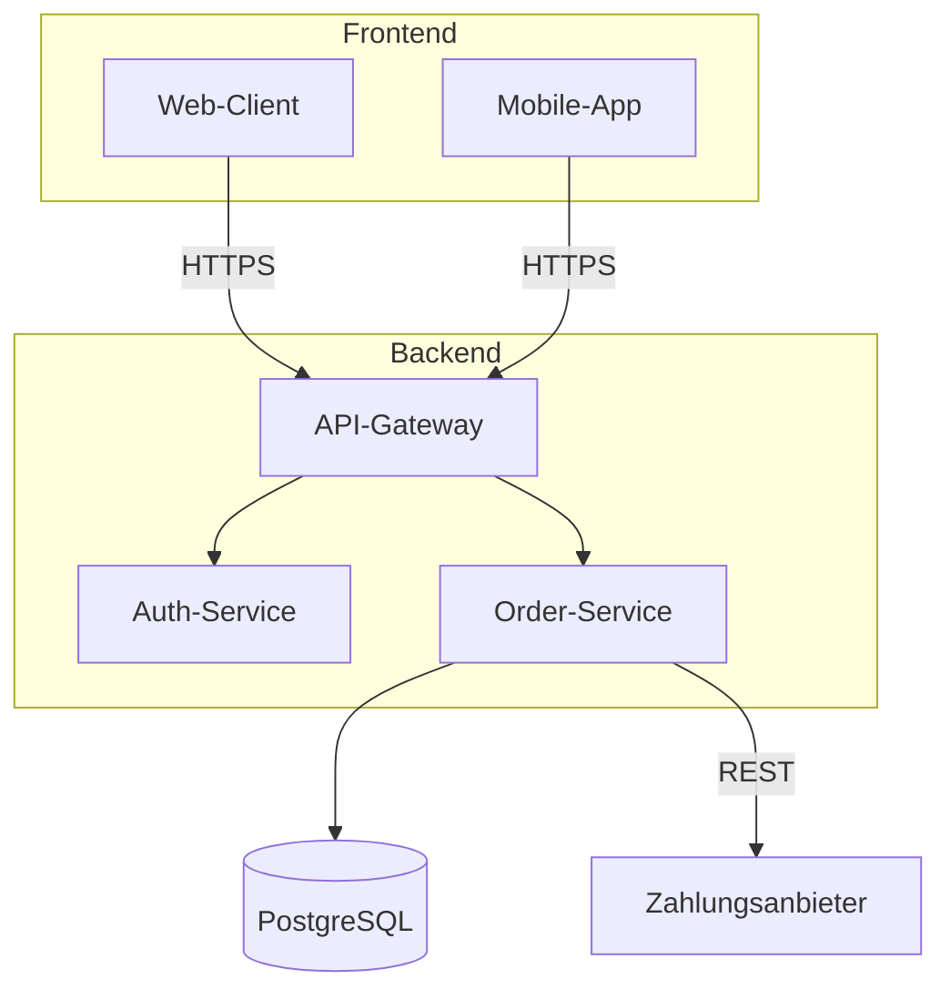
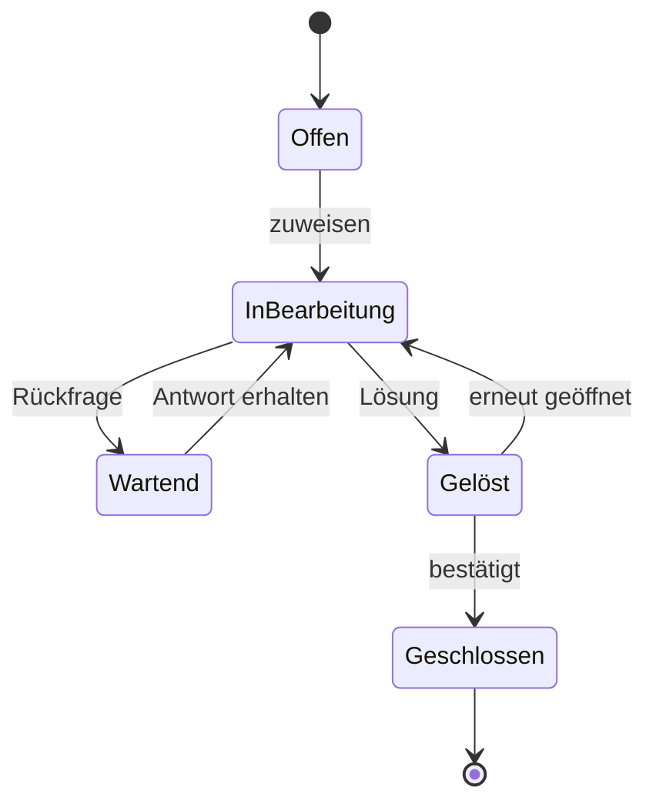

# PlantUML & Mermaid Beispiele

Eine Sammlung von Diagrammen als Lern- und Referenzbeispiele – jeweils in **zwei Formaten**:

- **`.puml`** (PlantUML): höchste Qualität, rendert in VS Code / plantuml.com, **aber NICHT auf GitHub**.
- **`.md`** (Mermaid): **rendert direkt hier auf GitHub** im Browser.

> GitHub unterstützt Mermaid nativ in Markdown, PlantUML jedoch nicht. Darum gibt es zu jedem
> Diagramm eine Mermaid-Variante als `.md`-Datei.

## Basis-Diagramme

| Thema | PlantUML | Mermaid (GitHub) |
|-------|----------|------------------|
| Sequenz – Login | [`diagrams/sequence.puml`](diagrams/sequence.puml) | [`diagrams/sequence.md`](diagrams/sequence.md) |
| Klasse – Onlineshop | [`diagrams/class.puml`](diagrams/class.puml) | [`diagrams/class.md`](diagrams/class.md) |
| Use Case – Bibliothek | [`diagrams/usecase.puml`](diagrams/usecase.puml) | [`diagrams/usecase.md`](diagrams/usecase.md) |
| Aktivität – Bestellprozess | [`diagrams/activity.puml`](diagrams/activity.puml) | [`diagrams/activity.md`](diagrams/activity.md) |
| Komponente – Architektur | [`diagrams/component.puml`](diagrams/component.puml) | [`diagrams/component.md`](diagrams/component.md) |
| Zustand – Ticket | [`diagrams/state.puml`](diagrams/state.puml) | [`diagrams/state.md`](diagrams/state.md) |

> Die umfangreicheren Beispiele unter [`enhanced/`](enhanced/) haben jeweils ihre eigene
> Mermaid-`.md`-Datei, werden hier aber nicht eingebettet.

---

## Vorschau (rendert direkt auf GitHub)

### Sequenz – Login-Ablauf

### Klasse – Domänenmodell

### Use Case – Bibliothek

### Aktivität – Bestellprozess

### Komponente – Architektur

### Zustand – Ticket-Lebenszyklus

---

## PlantUML rendern (`.puml`)

- **Online:** Inhalt nach <https://www.plantuml.com/plantuml> kopieren.
- **Lokal (Java + Graphviz):** `java -jar plantuml.jar diagrams/*.puml`
- **VS Code:** Extension „PlantUML" (jebbs), dann `Alt+D` zur Vorschau.