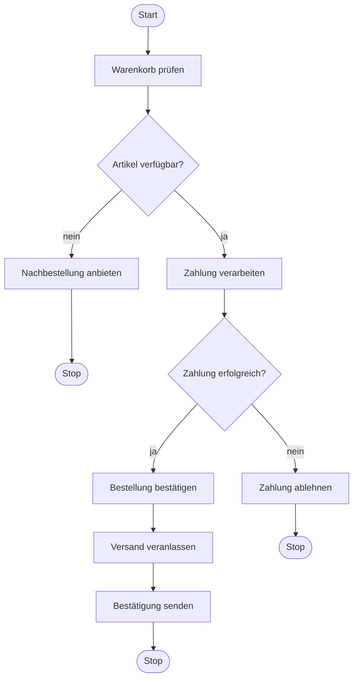

# Bestellprozess (Aktivitätsdiagramm, als Flowchart)

> Mermaid hat keinen Activity-Typ – Aktivitäten werden als `flowchart` modelliert.
> Original: [`activity.puml`](activity.puml).

```mermaid
flowchart TD
    Start([Start]) --> A[Warenkorb prüfen]
    A --> B{Artikel verfügbar?}
    B -- ja --> C[Zahlung verarbeiten]
    B -- nein --> D[Nachbestellung anbieten] --> S1([Stop])
    C --> E{Zahlung erfolgreich?}
    E -- ja --> F[Bestellung bestätigen]
    F --> G[Versand veranlassen]
    G --> H[Bestätigung senden]
    H --> S2([Stop])
    E -- nein --> I[Zahlung ablehnen] --> S3([Stop])
```