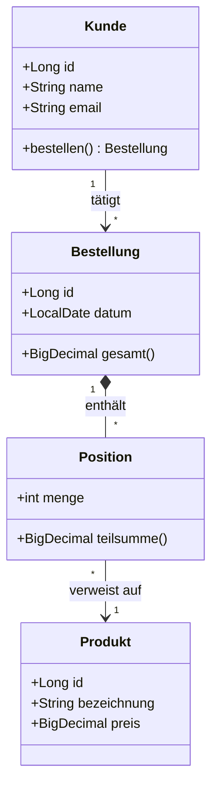

# Domänenmodell – Onlineshop (Klassendiagramm)

> Mermaid-Version von [`class.puml`](class.puml).

```mermaid
classDiagram
    class Kunde {
      +Long id
      +String name
      +String email
      +bestellen() Bestellung
    }
    class Bestellung {
      +Long id
      +LocalDate datum
      +BigDecimal gesamt()
    }
    class Position {
      +int menge
      +BigDecimal teilsumme()
    }
    class Produkt {
      +Long id
      +String bezeichnung
      +BigDecimal preis
    }
    Kunde "1" --> "*" Bestellung : tätigt
    Bestellung "1" *-- "*" Position : enthält
    Position "*" --> "1" Produkt : verweist auf
```