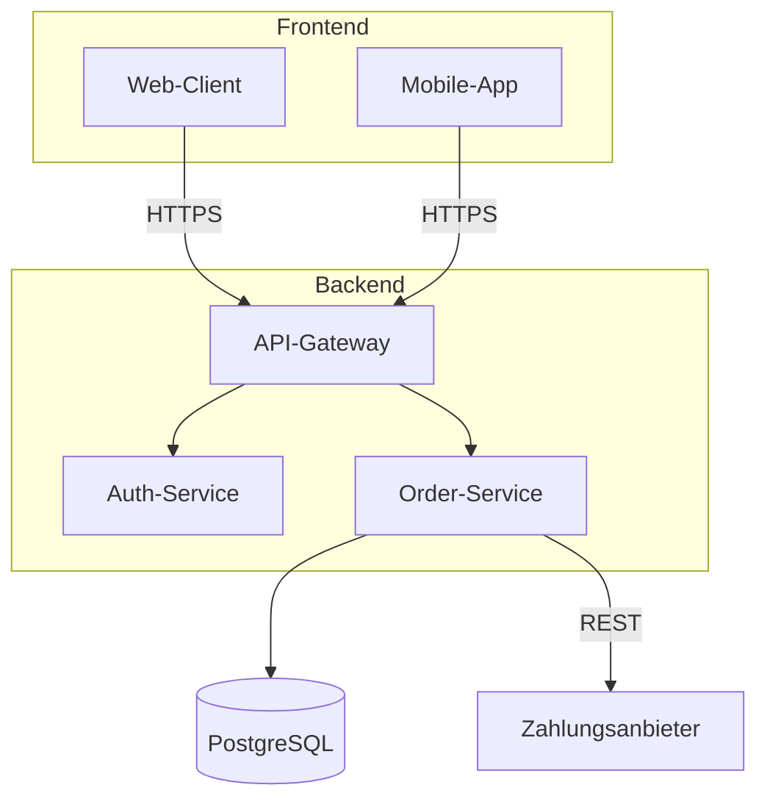

# Systemarchitektur (Komponentendiagramm, als Flowchart)

> Mermaid hat keinen Component-Typ – nachgebildet mit `flowchart` + Subgraphen.
> Original: [`component.puml`](component.puml).

```mermaid
flowchart TD
    subgraph Frontend
      WC[Web-Client]
      MA[Mobile-App]
    end
    subgraph Backend
      GW[API-Gateway]
      AUTH[Auth-Service]
      ORD[Order-Service]
    end
    DB[(PostgreSQL)]
    PAY[Zahlungsanbieter]
    WC -->|HTTPS| GW
    MA -->|HTTPS| GW
    GW --> AUTH
    GW --> ORD
    ORD --> DB
    ORD -->|REST| PAY
```