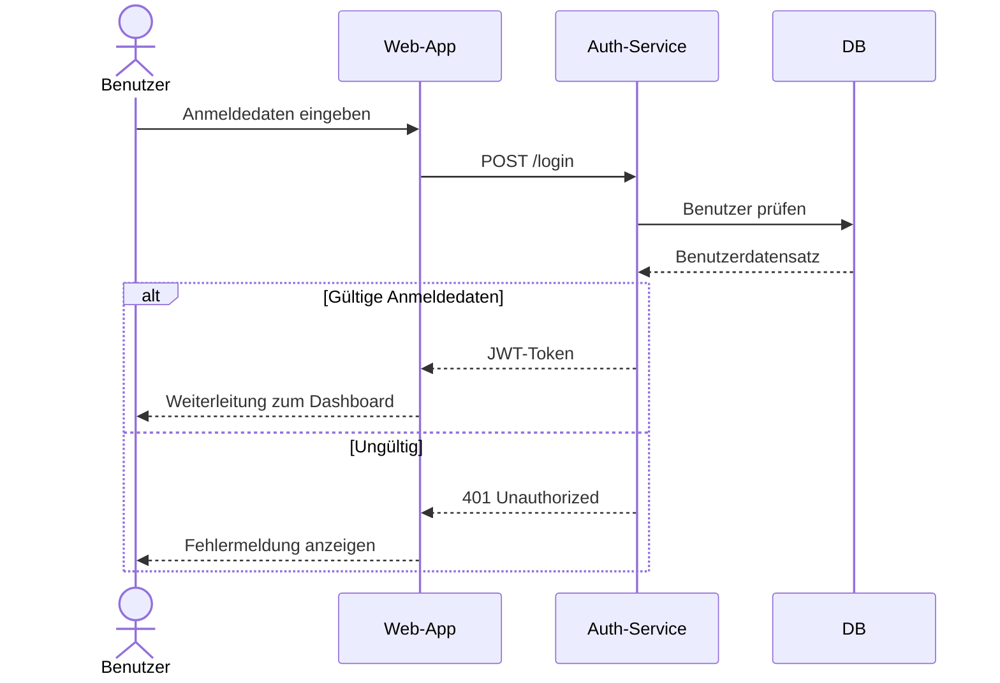

# Login-Ablauf (Sequenzdiagramm)

> Mermaid-Version von [`sequence.puml`](sequence.puml) – rendert direkt auf GitHub.

```mermaid
sequenceDiagram
    actor Benutzer
    participant Web as Web-App
    participant Auth as Auth-Service
    participant DB
    Benutzer->>Web: Anmeldedaten eingeben
    Web->>Auth: POST /login
    Auth->>DB: Benutzer prüfen
    DB-->>Auth: Benutzerdatensatz
    alt Gültige Anmeldedaten
        Auth-->>Web: JWT-Token
        Web-->>Benutzer: Weiterleitung zum Dashboard
    else Ungültig
        Auth-->>Web: 401 Unauthorized
        Web-->>Benutzer: Fehlermeldung anzeigen
    end
```