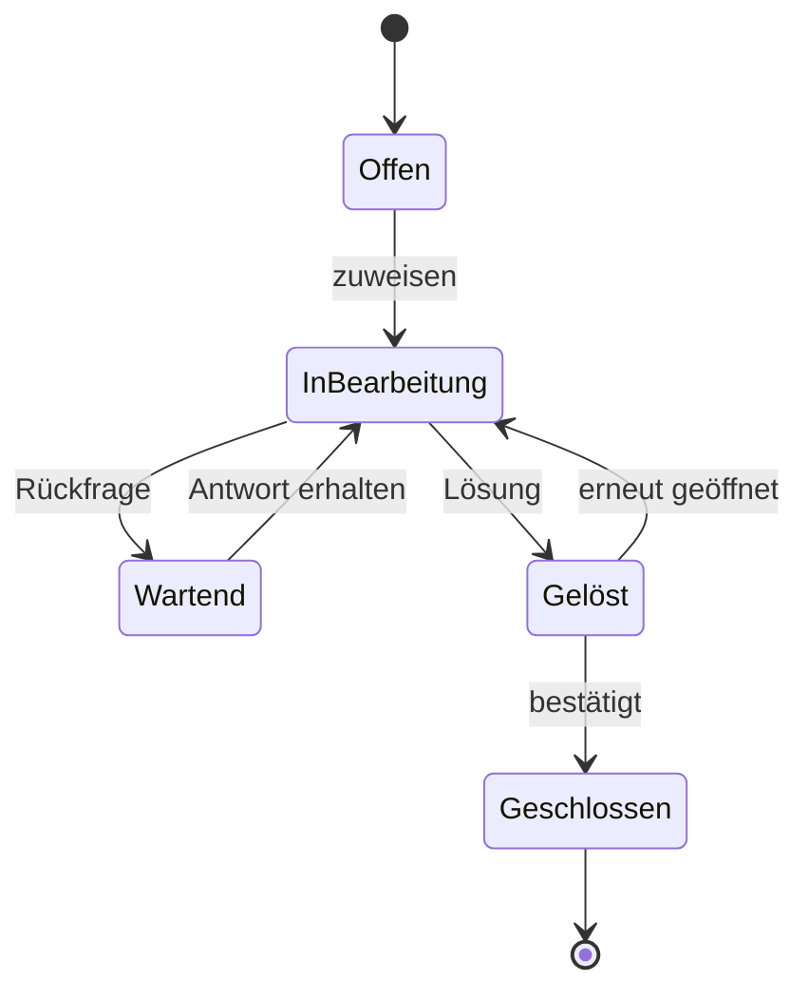

# Ticket-Lebenszyklus (Zustandsdiagramm)

> Mermaid-Version von [`state.puml`](state.puml).

```mermaid
stateDiagram-v2
    [*] --> Offen
    Offen --> InBearbeitung : zuweisen
    InBearbeitung --> Wartend : Rückfrage
    Wartend --> InBearbeitung : Antwort erhalten
    InBearbeitung --> Gelöst : Lösung
    Gelöst --> Geschlossen : bestätigt
    Gelöst --> InBearbeitung : erneut geöffnet
    Geschlossen --> [*]
```