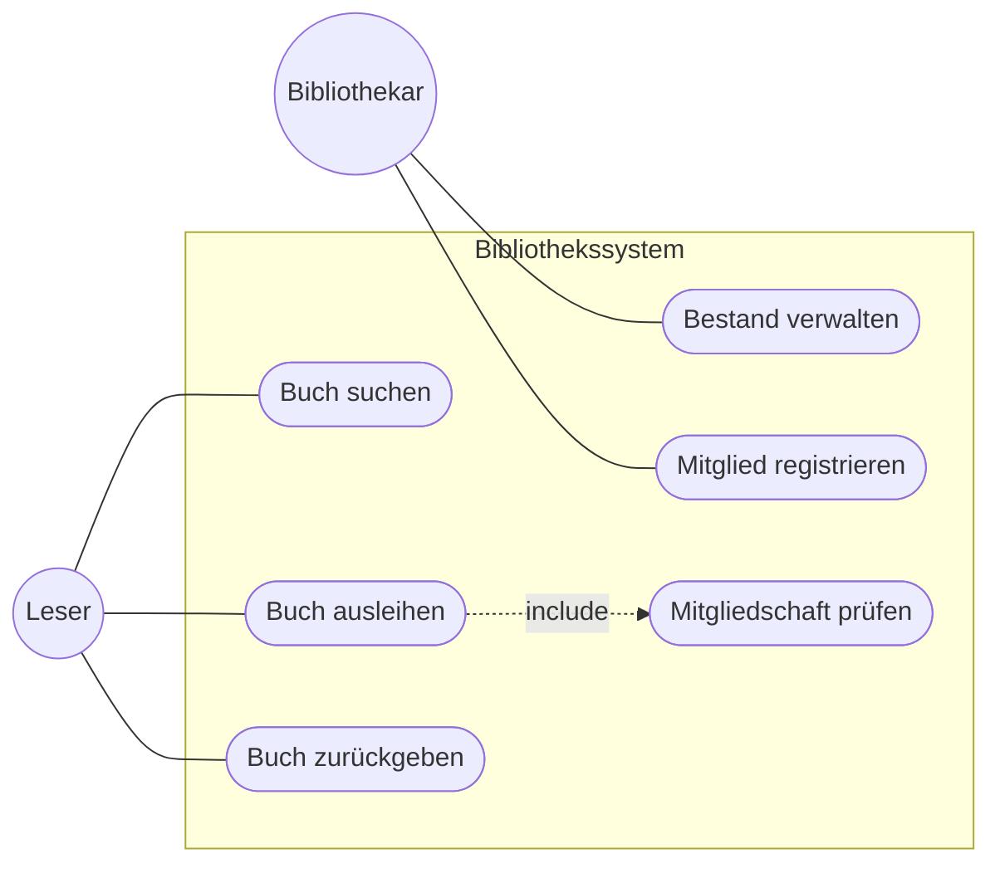

# Anwendungsfälle – Bibliothek (Use-Case, als Flowchart nachgebildet)

> Mermaid kennt keinen eigenen Use-Case-Typ – nachgebildet mit `flowchart`.
> Original: [`usecase.puml`](usecase.puml).

```mermaid
flowchart LR
    Leser((Leser))
    Bibliothekar((Bibliothekar))
    subgraph Bibliothekssystem
      UC1([Buch suchen])
      UC2([Buch ausleihen])
      UC3([Buch zurückgeben])
      UC4([Bestand verwalten])
      UC5([Mitglied registrieren])
      UC6([Mitgliedschaft prüfen])
    end
    Leser --- UC1
    Leser --- UC2
    Leser --- UC3
    Bibliothekar --- UC4
    Bibliothekar --- UC5
    UC2 -. include .-> UC6
```