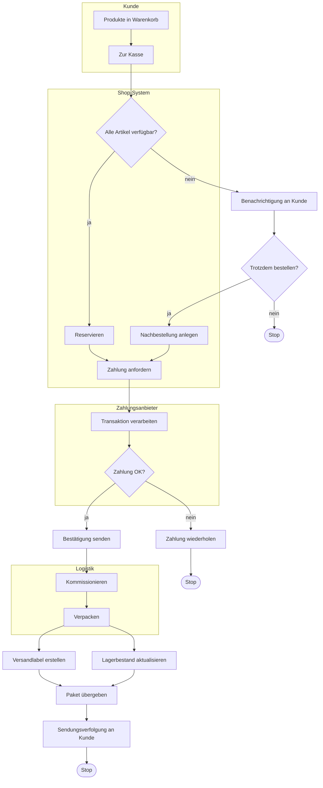

# Bestellabwicklung mit „Swimlanes" (Aktivität → Flowchart)

> Mermaid hat keine echten Swimlanes – nachgebildet mit Subgraphen.
> Original: [`activity_swimlanes.puml`](activity_swimlanes.puml).

```mermaid
flowchart TD
    subgraph Kunde
      A[Produkte in Warenkorb] --> B[Zur Kasse]
    end
    B --> C{Alle Artikel verfügbar?}
    subgraph Shop["Shop-System"]
      C
      R[Reservieren]
      NB[Nachbestellung anlegen]
      P[Zahlung anfordern]
    end
    C -- ja --> R --> P
    C -- nein --> N[Benachrichtigung an Kunde]
    N --> N2{Trotzdem bestellen?}
    N2 -- ja --> NB --> P
    N2 -- nein --> S1([Stop])
    subgraph Zahlung["Zahlungsanbieter"]
      T[Transaktion verarbeiten] --> TO{Zahlung OK?}
    end
    P --> T
    TO -- nein --> RW[Zahlung wiederholen] --> S2([Stop])
    TO -- ja --> CF[Bestätigung senden]
    subgraph Logistik
      K[Kommissionieren] --> V[Verpacken]
    end
    CF --> K
    V --> L1[Versandlabel erstellen]
    V --> L2[Lagerbestand aktualisieren]
    L1 --> U[Paket übergeben]
    L2 --> U
    U --> TR[Sendungsverfolgung an Kunde] --> E([Stop])
```