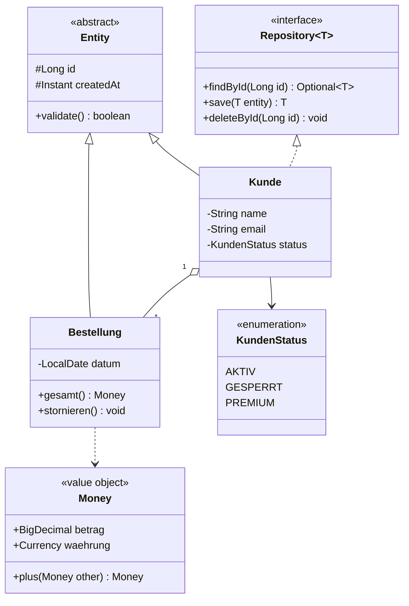

# Domänenmodell mit Generics, Interface & Enum (Klasse)

> Mermaid-Version von [`class_advanced.puml`](class_advanced.puml).

```mermaid
classDiagram
    class Repository~T~ {
      <<interface>>
      +findById(Long id) Optional~T~
      +save(T entity) T
      +deleteById(Long id) void
    }
    class Entity {
      <<abstract>>
      #Long id
      #Instant createdAt
      +validate() boolean
    }
    class Kunde {
      -String name
      -String email
      -KundenStatus status
    }
    class Bestellung {
      -LocalDate datum
      +gesamt() Money
      +stornieren() void
    }
    class KundenStatus {
      <<enumeration>>
      AKTIV
      GESPERRT
      PREMIUM
    }
    class Money {
      <<value object>>
      +BigDecimal betrag
      +Currency waehrung
      +plus(Money other) Money
    }
    Entity <|-- Kunde
    Entity <|-- Bestellung
    Repository <|.. Kunde
    Kunde "1" o-- "*" Bestellung
    Kunde --> KundenStatus
    Bestellung ..> Money
```