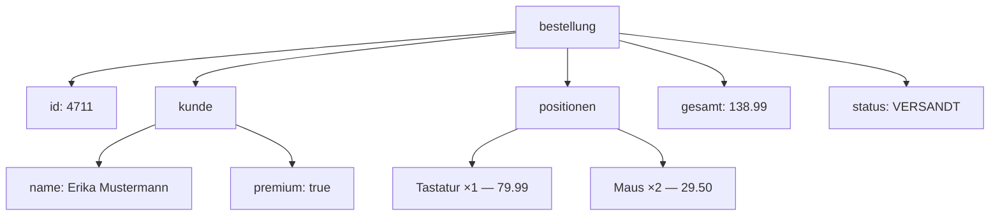

# Beispiel-Datenstruktur (JSON → Flowchart-Baum)

> Mermaid hat **kein** `@startjson`-Äquivalent – die JSON-Struktur ist hier als Baum dargestellt.
> Original: [`data.json.puml`](data.json.puml).

```mermaid
flowchart TD
    B[bestellung] --> ID[id: 4711]
    B --> K[kunde]
    K --> KN[name: Erika Mustermann]
    K --> KP[premium: true]
    B --> P[positionen]
    P --> P1["Tastatur ×1 — 79.99"]
    P --> P2["Maus ×2 — 29.50"]
    B --> G[gesamt: 138.99]
    B --> ST[status: VERSANDT]
```