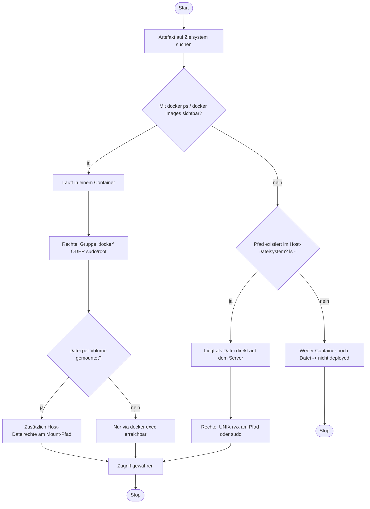

# Entscheidungshilfe: Docker-Container oder Datei? (Flowchart)

> Mermaid-Version von [`decide_docker_or_file.puml`](decide_docker_or_file.puml).

```mermaid
flowchart TD
    Start([Start]) --> S[Artefakt auf Zielsystem suchen]
    S --> Q1{Mit docker ps / docker images sichtbar?}
    Q1 -- ja --> C[Läuft in einem Container]
    C --> R1["Rechte: Gruppe 'docker' ODER sudo/root"]
    R1 --> Q2{Datei per Volume gemountet?}
    Q2 -- ja --> V[Zusätzlich Host-Dateirechte am Mount-Pfad]
    Q2 -- nein --> X[Nur via docker exec erreichbar]
    Q1 -- nein --> Q3{Pfad existiert im Host-Dateisystem? ls -l}
    Q3 -- ja --> F[Liegt als Datei direkt auf dem Server]
    F --> R2["Rechte: UNIX rwx am Pfad oder sudo"]
    Q3 -- nein --> NF[Weder Container noch Datei -> nicht deployed]
    NF --> Stop1([Stop])
    V --> G[Zugriff gewähren]
    X --> G
    R2 --> G
    G --> Stop2([Stop])
```