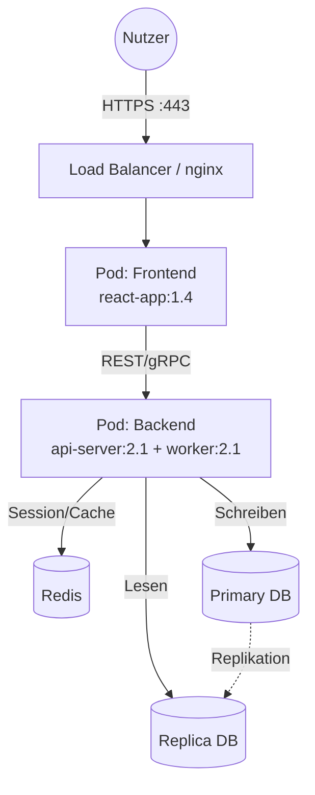

# Deployment – Cloud-Architektur (→ Flowchart)

> Mermaid hat keinen Deployment-Typ – nachgebildet mit `flowchart`.
> Original: [`deployment.puml`](deployment.puml).

```mermaid
flowchart TD
    Nutzer((Nutzer)) -->|HTTPS :443| LB[Load Balancer / nginx]
    LB --> FE["Pod: Frontend<br/>react-app:1.4"]
    FE -->|REST/gRPC| BE["Pod: Backend<br/>api-server:2.1 + worker:2.1"]
    BE -->|Session/Cache| Cache[(Redis)]
    BE -->|Schreiben| PDB[(Primary DB)]
    BE -->|Lesen| RDB[(Replica DB)]
    PDB -. Replikation .-> RDB
```