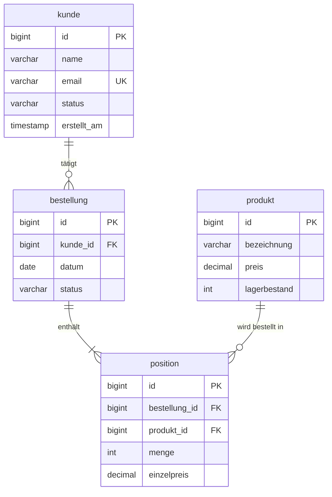

# Entity-Relationship – Onlineshop

> Mermaid-Version von [`er_diagram.puml`](er_diagram.puml).

```mermaid
erDiagram
    kunde ||--o{ bestellung : "tätigt"
    bestellung ||--|{ position : "enthält"
    produkt ||--o{ position : "wird bestellt in"
    kunde {
      bigint id PK
      varchar name
      varchar email UK
      varchar status
      timestamp erstellt_am
    }
    bestellung {
      bigint id PK
      bigint kunde_id FK
      date datum
      varchar status
    }
    position {
      bigint id PK
      bigint bestellung_id FK
      bigint produkt_id FK
      int menge
      decimal einzelpreis
    }
    produkt {
      bigint id PK
      varchar bezeichnung
      decimal preis
      int lagerbestand
    }
```