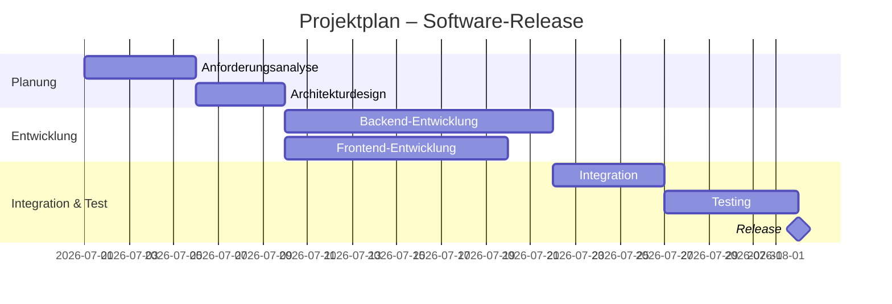

# Projektplan – Software-Release (Gantt)

> Mermaid-Version von [`gantt.puml`](gantt.puml).
> Hinweis: Mermaid kann „after" nur auf **eine** Vorgängeraufgabe beziehen –
> Integration ist daher an die längere Aufgabe (Backend) gehängt.

