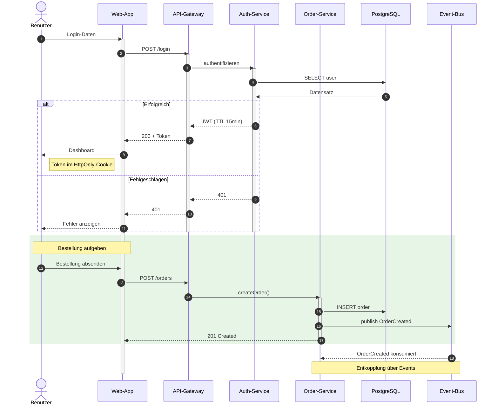

# Erweiterter Login- & Bestellablauf (Sequenz)

> Mermaid-Version von [`sequence_advanced.puml`](sequence_advanced.puml).

```mermaid
sequenceDiagram
    autonumber
    actor U as Benutzer
    participant Web as Web-App
    participant GW as API-Gateway
    participant Auth as Auth-Service
    participant Ord as Order-Service
    participant DB as PostgreSQL
    participant MQ as Event-Bus
    U->>Web: Login-Daten
    activate Web
    Web->>GW: POST /login
    activate GW
    GW->>Auth: authentifizieren
    activate Auth
    Auth->>DB: SELECT user
    DB-->>Auth: Datensatz
    alt Erfolgreich
        Auth-->>GW: JWT (TTL 15min)
        GW-->>Web: 200 + Token
        Web-->>U: Dashboard
        Note right of U: Token im HttpOnly-Cookie
    else Fehlgeschlagen
        Auth-->>GW: 401
        GW-->>Web: 401
        Web-->>U: Fehler anzeigen
    end
    deactivate Auth
    deactivate GW
    rect rgb(230,245,230)
    Note over U,Web: Bestellung aufgeben
    U->>Web: Bestellung absenden
    Web->>GW: POST /orders
    GW->>Ord: createOrder()
    activate Ord
    Ord->>DB: INSERT order
    Ord->>MQ: publish OrderCreated
    Ord-->>Web: 201 Created
    deactivate Ord
    end
    MQ-->>Ord: OrderCreated konsumiert
    Note over MQ,Ord: Entkopplung über Events
    deactivate Web
```