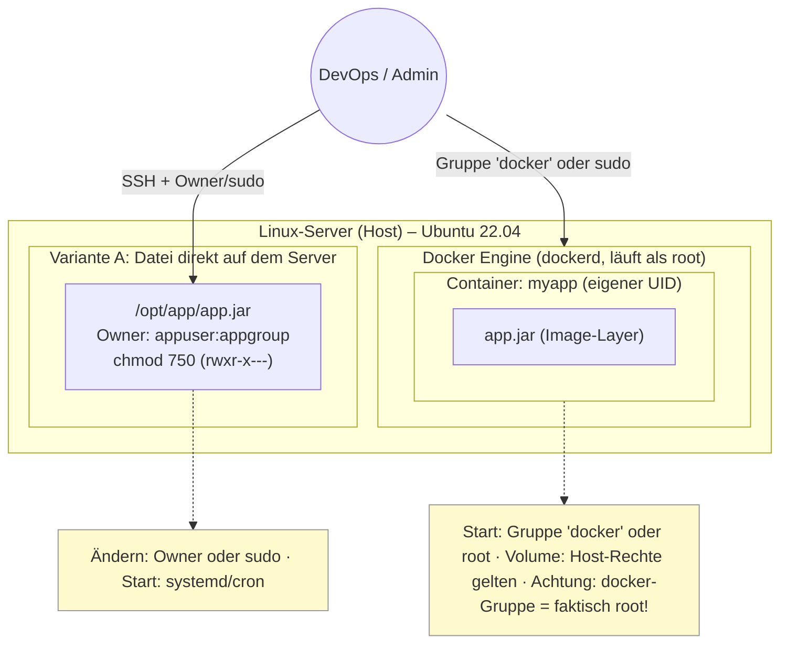

# Docker-Container vs. Datei auf dem Server – inkl. Berechtigungen

> Mermaid-Version von [`server_docker_vs_file_permissions.puml`](server_docker_vs_file_permissions.puml).

```mermaid
flowchart TD
    Admin((DevOps / Admin))
    subgraph Host["Linux-Server (Host) – Ubuntu 22.04"]
      subgraph VarA["Variante A: Datei direkt auf dem Server"]
        FileA["/opt/app/app.jar<br/>Owner: appuser:appgroup<br/>chmod 750 (rwxr-x---)"]
      end
      subgraph Engine["Docker Engine (dockerd, läuft als root)"]
        subgraph Cont["Container: myapp (eigener UID)"]
          FileB["app.jar (Image-Layer)"]
        end
      end
    end
    Admin -->|SSH + Owner/sudo| FileA
    Admin -->|Gruppe 'docker' oder sudo| Engine
    NoteA["Ändern: Owner oder sudo · Start: systemd/cron"]
    NoteB["Start: Gruppe 'docker' oder root · Volume: Host-Rechte gelten · Achtung: docker-Gruppe = faktisch root!"]
    FileA -.-> NoteA
    Cont -.-> NoteB
    classDef note fill:#FFFACD,stroke:#999,color:#333;
    class NoteA,NoteB note;
```