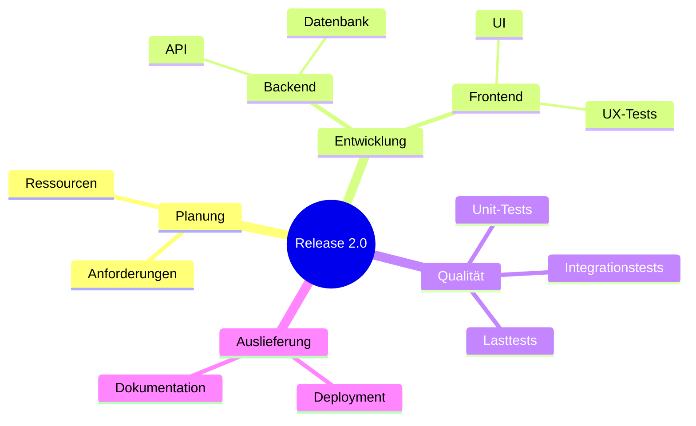

# Work Breakdown Structure – Release 2.0 (→ Mindmap)

> Mermaid hat keinen WBS-Typ – am nächsten kommt `mindmap`.
> Original: [`wbs.puml`](wbs.puml).

```mermaid
mindmap
  root((Release 2.0))
    Planung
      Anforderungen
      Ressourcen
    Entwicklung
      Backend
        API
        Datenbank
      Frontend
        UI
        UX-Tests
    Qualität
      Unit-Tests
      Integrationstests
      Lasttests
    Auslieferung
      Deployment
      Dokumentation
```